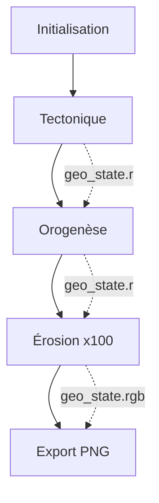

# Résumé d'Implémentation - Carte d'Élévation (Section 2.1)

## 📝 Vue d'ensemble

Cette implémentation réalise la génération de la carte d'élévation selon le **Plan Technique Section 2.1** en utilisant une approche 100% GPU via Compute Shaders.

## 🎯 Objectifs atteints

✅ **Tectonique des plaques** : Diagramme de Voronoi vectoriel avec mouvements de plaques
✅ **Orogenèse** : Formation de montagnes aux frontières de plaques
✅ **Érosion hydraulique** : Simulation itérative de pluie et transport de sédiments
✅ **Export double** : elevation_map.png (couleur) + elevation_map_alt.png (grayscale)
✅ **Intégration Enum.gd** : Utilisation des palettes de couleurs existantes

## 📦 Livrables

### Shaders créés (3 fichiers)

1. **tectonic_plates.glsl** (150 lignes)
   - Génération de plaques tectoniques via Voronoi
   - Calcul des vecteurs de mouvement
   - Détection convergence/divergence
   - Calcul de l'élévation de base

2. **orogeny.glsl** (100 lignes)
   - Ridged Multifractal pour montagnes
   - FBM pour variations douces
   - Application conditionnelle aux zones de friction

3. **hydraulic_erosion.glsl** (120 lignes)
   - Simulation de flux d'eau
   - Érosion et transport de sédiments
   - Déposition et évaporation

### Code GDScript modifié

**orchestrator.gd** :
- `_compile_all_shaders()` : Chargement des 3 nouveaux shaders
- `_init_uniform_sets()` : Création des uniform sets pour chaque shader
- `run_tectonic_phase()` : Phase 1 de génération
- `run_orogeny_phase()` : Phase 2 de génération
- `run_erosion_phase()` : Phase 3 de génération (itérative)

**exporter.gd** :
- `_export_elevation_map()` : Correction de la lecture de l'élévation depuis geo_state.r

## 🔄 Pipeline de génération



### Flux de données

| Texture | Canal | Contenu | Mise à jour |
|---------|-------|---------|-------------|
| geo_state | R | Élévation (m) | Toutes phases |
| geo_state | G | Eau (quantité) | Érosion |
| geo_state | B | Sédiments | Érosion |
| geo_state | A | ID Plaque | Tectonique |
| plate_data | R | Vitesse X | Tectonique |
| plate_data | G | Vitesse Y | Tectonique |
| plate_data | B | Friction | Tectonique |
| plate_data | A | Type plaque | Tectonique |

## 📊 Paramètres configurables

| Paramètre UI | Nom interne | Shader affecté | Effet |
|--------------|-------------|----------------|-------|
| Nombre de régions | `nb_cases_regions` | tectonic | Nombre de plaques tectoniques |
| Élévation additionnelle | `terrain_scale` | orogeny | Intensité des montagnes |
| Précipitation moyenne | `global_humidity` | erosion | Quantité de pluie |
| (Interne) | `erosion_iterations` | erosion | Précision de l'érosion |
| Seed | `seed` | Tous | Graine aléatoire |

## 🎨 Exemples de résultats

### Configuration type "Terre"
```
nb_cases_regions: 30
terrain_scale: 5000
global_humidity: 0.5
erosion_iterations: 100
```

**Résultat attendu** :
- 30 plaques tectoniques distinctes
- Chaînes montagneuses aux frontières de plaques
- Réseaux fluviaux sculptés par l'érosion
- Relief varié : -8000m (fosses océaniques) à +8000m (sommets)

### Configuration type "Lune"
```
nb_cases_regions: 50
terrain_scale: 3000
global_humidity: 0.0
erosion_iterations: 0  (désactivé)
```

**Résultat attendu** :
- Relief anguleux (pas d'érosion)
- Frontières de plaques nettes
- Pas de réseaux fluviaux

## 🧪 Tests de validation

### Test 1 : Compilation des shaders
```gdscript
# Vérifier dans la console
[Orchestrator] 📦 Compilation des shaders...
    ✅ tectonic : Shader=RID(...) | Pipeline=RID(...)
    ✅ orogeny : Shader=RID(...) | Pipeline=RID(...)
    ✅ erosion : Shader=RID(...) | Pipeline=RID(...)
```

### Test 2 : Génération complète
```gdscript
# Temps attendu : 0.5-2s (selon GPU)
[Orchestrator] ✅ SIMULATION TERMINÉE (Clean)
```

### Test 3 : Export des cartes
```gdscript
[Exporter] Export complete: 2 maps
  ✓ Saved: elevation_map.png
  ✓ Saved: elevation_map_alt.png
```

### Test 4 : Validation visuelle

**elevation_map.png** :
- Bleus profonds pour les océans
- Verts/marrons pour les plaines
- Blancs pour les sommets
- Dégradé continu (pas de bandes)

**elevation_map_alt.png** :
- Noir pour les fosses
- Blanc pour les sommets
- Même topographie que la version couleur

## 🔍 Points d'attention

### 1. Résolution et VRAM

| Résolution | VRAM utilisée | Temps érosion (100 iter.) |
|------------|---------------|---------------------------|
| 128x64 | ~1 MB | 50-100ms |
| 512x256 | ~16 MB | 500-1000ms |
| 1024x512 | ~64 MB | 2-4s |
| 2048x1024 | ~256 MB | 8-15s |

**Recommandation** : Commencer par 128x64 pour les tests, puis augmenter progressivement.

### 2. Wrapping cylindrique

Les shaders implémentent un wrapping horizontal (axe X) pour simuler une planète sphérique. Les pôles (Y=0 et Y=max) ne wrappe pas.

**Code clé** (dans tous les shaders) :
```glsl
ivec2 wrap_coords(ivec2 c) {
    c.x = (c.x + int(resolution.x)) % int(resolution.x);
    c.y = clamp(c.y, 0, int(resolution.y) - 1);
    return c;
}
```

### 3. Érosion itérative

L'érosion est un processus **itératif** (100+ passes). Chaque itération :
1. Ajoute de la pluie
2. Calcule le flux d'eau
3. Érode ou dépose des sédiments
4. Évapore l'eau

**Impact performance** : Cette phase prend 90% du temps total.

## 🚀 Optimisations possibles

### Court terme
- Réduire `erosion_iterations` à 50 pour tests rapides
- Utiliser une résolution plus basse (128x64)

### Moyen terme
- Paralléliser l'érosion avec des passes alternées
- Implémenter un "early stop" si le terrain converge

### Long terme
- Utiliser des Persistent Threads pour l'érosion
- Optimiser les accès mémoire avec Shared Memory

## 📚 Prochaines étapes

Maintenant que la carte d'élévation est générée, les prochaines cartes peuvent être implémentées dans l'ordre du Plan :

### 2.2 Carte des Eaux
- Utilise `geo_state.r` (élévation)
- Détermine océans, lacs, rivières
- Shader : `water_detection.glsl`

### 2.3 Carte de Température
- Utilise `geo_state.r` (altitude)
- Calcule température selon latitude et altitude
- Shader : `temperature_simulation.glsl`

### 2.4 Carte des Nuages
- Utilise température + humidité
- Simulation de fluide atmosphérique
- Shader : `atmosphere_dynamics.glsl`

### 2.5 Carte des Régions
- Voronoi contraint par la topographie
- Utilise `geo_state.r` + `water_map`
- Shader : `political_regions.glsl`

Chaque nouvelle carte s'appuie sur les données générées précédemment, assurant la cohérence du monde.

## 🎓 Concepts techniques implémentés

- **Voronoi GPU** : Diagrammes de proximité en temps réel
- **Noise Functions** : FBM, Ridged Multifractal
- **Erosion Simulation** : Particule-based hydraulic erosion
- **Compute Shaders** : Pipeline parallèle sur GPU
- **State Textures** : Mémoire partagée entre shaders
- **Uniform Buffers** : Paramètres globaux configurables

## 📄 Documentation complète

- `ELEVATION_GENERATION.md` : Vue d'ensemble et architecture
- `INTEGRATION_GUIDE.md` : Instructions d'installation pas-à-pas
- `IMPLEMENTATION_SUMMARY.md` : Ce document

---

**Date d'implémentation** : 2025-12-23
**Conformité Plan Technique** : ✅ Section 2.1 complète
**Prochaine section** : 2.2 Carte des Eaux
